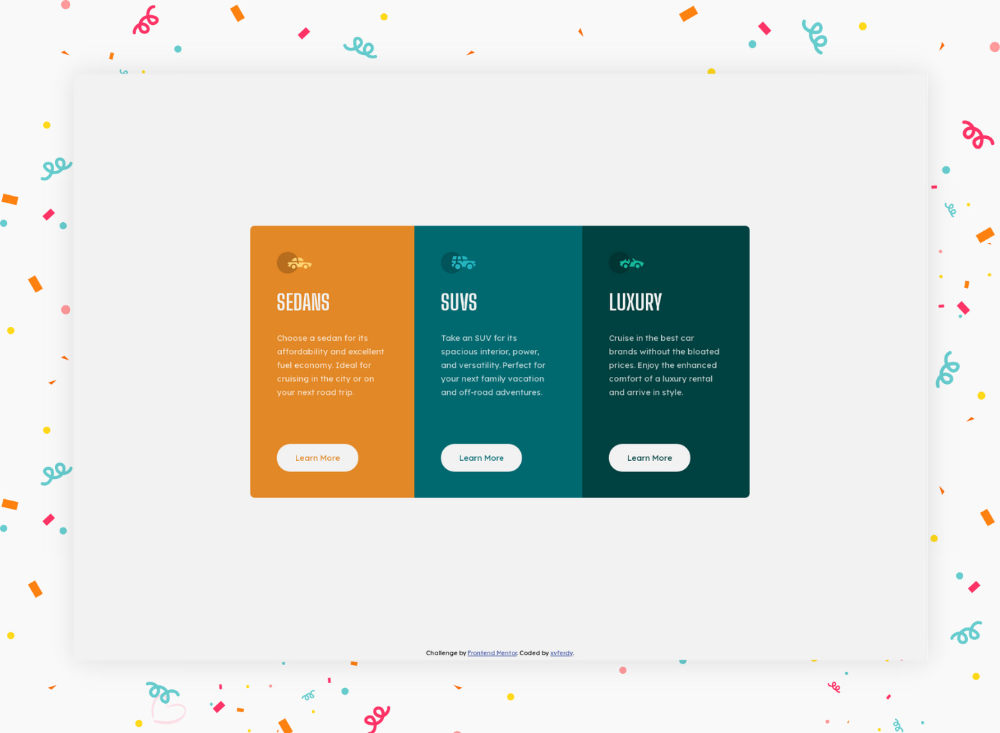

# 3-column preview card component

> 🔖 This is a solution for the [3-column preview card component challenge on Frontend Mentor](https://www.frontendmentor.io/challenges/3column-preview-card-component-pH92eAR2-).

## 🌈 ✨ 🎉 Have Fun Building! 🚀 🎊 🎈
> 🖥️ **Welcome** <br>
> Thanks for checking out this front-end coding challenge.
[Frontend Mentor](https://www.frontendmentor.io) challenges help you improve your coding skills by building realistic projects.
***To do this challenge, you need a basic understanding of HTML and CSS.*** Press <kbd>Enter</kbd> 🚀 to start the game!!

## 📍Table of Contents
- [Brief](#brief)
- [The challenge](#the-challenge)
- [Links](#links)
- [My process](#my-process)
- [Built with](#built-with)
- [What I learned](#what-i-learned-)
- [Difficult Things](#difficult-things-)
- [Author](#author)

## Brief
This challenge is perfect if you're just getting started. The shift between the layouts will be a nice test if you're new to building responsive projects.

Your challenge is to build out this **3-column preview card component** and get it looking as close to the design as possible. You can use any tools you like to help you complete the challenge. So if you've got something you'd like to practice, feel free to give it a go 👍.

**Preview** :eyeglasses:



## The challenge 
Users should be able to:
  
| Challenge | Newbie | Junior | Intermediate | Advanced |
| --- | :---: | :---: | :---: | :---: |
| View the optimal layout depending on their device's screen size | ⭕ |  |  |  |
| See hover states for interactive elements | ⭕ |  |  |  |

[](https://www.frontendmentor.io/challenges?difficulties=1)

## Links
- Solution URL: [Frontend Mentor Solution](https://www.frontendmentor.io/solutions/preview-card-component-3-column-html-sass-ayc3z8SZO)
- Live Site URL: [Github Pages](https://xvferdy.github.io/fem-3-column-preview-card-component/)

## My process
> ⌛ I challenge my self to finish this for ***~2 days*** <br>
> ▐ <br>
> 🧑‍💻 ***Day 1.*** <br>
> ▐ <sub>Folder structure <kbd>~0.5 hours</kbd></sub> <br>
> ▐ <sub>[HTML](https://developer.mozilla.org/en-US/docs/Web/HTML) content & basic [CSS](https://developer.mozilla.org/en-US/docs/Web/CSS) <kbd>~1.5 hours</kbd></sub> <br>
> ▐ <sub>Start styling & try mobile first approach <kbd>~2.5 day</kbd></sub> <br>
> ▐ <br>
> 🌐 ***Next day*** Submit to [**Frontend Mentor**](https://www.frontendmentor.io/solutions/preview-card-component-3-column-html-sass-ayc3z8SZO "Solution") 🚩 <br>
> ▐ <br>
> 🗓️ 

## Built with
- [HTML](https://developer.mozilla.org/en-US/docs/Web/HTML "developer.mozilla")
- [CSS](https://www.w3.org/Style/CSS/Overview.en.html "W3C")
- ❤️

## What I learned 🥳
This is my very first trying _mobile first approach_ for designing a website, TBH I'm not really comfortable and this lead me to writing unnecessary **CSS** code. But I will fix my self and study more.

###### ./stylesheets/scss/helpers/\_breakpoints.scss
```scss
@mixin display($breakpoint) {
  @if ($breakpoint == sm-phone) {
  @media only screen and(max-width: 320px) {
    @content;
    }
  }

  @if ($breakpoint == desktop) {
  @media only screen and(min-width: 900px) {
    @content;
  }
 }
}
```

## Difficult Things 😵‍💫
Things were difficult for me and I finally gave up‼️
- [ ] Try to use `grid`
- [ ] Write a clean **CSS** code

## Author
| [<br><sub><samp>Berlianto</samp></sub>](https://github.com/xvferdy)  |
|:---:|

<h3 align="right">
      <a href="#readme">To Top ✪</a>
</h3>
